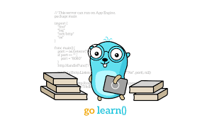

<p align="center">
    
</p>

<h1 align="center">
Event Man
</h1>

Event man is an event publisher with SSE implemented with Golang. With event publisher, you can send events to your clients, and
also you can check the events' history. Event man uses SSE protocol to create streams between clients
and the main server.

## How to use project?
To run the project, clone the repository:
```shell
git clone https://github.com/amirhnajafiz/event-man.git
cd event-man
```

### Golang
Start using golang:
```shell
go run main.go
```

### Docker
Start the project with docker:
```shell
docker build . -t event-man --platform linux/amd64
docker run -p 8080:8080 event-man
```

### Routes
Connect to event-man server:
- URL: 0.0.0.0:8080/connect
- Method: GET

Send event:
- URL: 0.0.0.0:8080/push
- Method: POST
- Body: ```{"event": "[event]", "data": "[data]"}```

Send event to a single client:
- URL: 0.0.0.0:8080/push/single
- Method: POST
- Body: ```{"event": "[event]", "data": "[data]", "reference", "[reference]"}```

Get events history:
- URL: 0.0.0.0:8080/history
- Method: GET

## Clients
### Golang
If you're using golang client, you can connect to the main server
and receive the events:
```go
feed, err := net.ConnectWithSSEFeed("http://localhost:8080/connect", nil)
```

Listen for events:
```go
sub, err := feed.Subscribe("message")
```

Get the events:
```go
for {
		select {
		case evt := <-sub.Feed():
			log.Print(evt)
		case err := <-sub.ErrFeed():
			log.Fatal(err)

			return
		}
	}
```

### PWA
And for web-applications, with the following example you
can connect to the event-man server and listen for events:
```js
let sseSource = new EventSource("http://localhost:8080/connect");

sseSource.addEventListener("message", ev => {
    console.log(ev)
    // ...
})
```

## Deploy
If you want to deploy the project on a kubernetes cluster, use the following command:
```shell
helm install event-man charts/event-man
```
